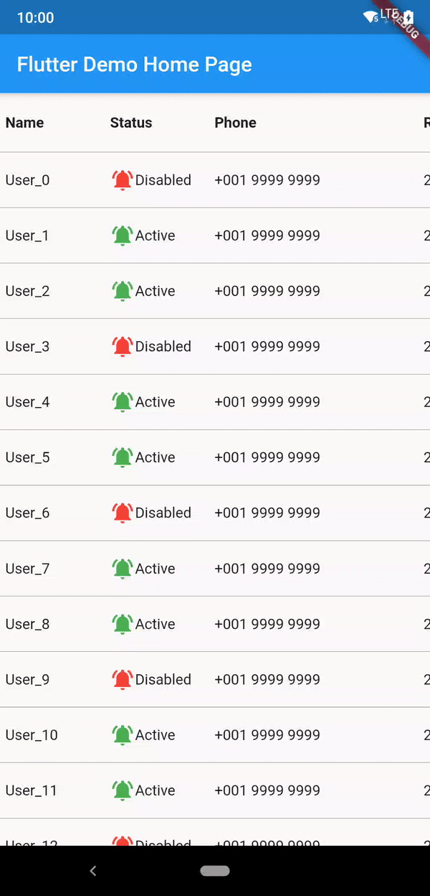

# horizontal_data_table
[](https://pub.dev/packages/horizontal_data_table)
[](https://github.com/MayLau-CbL/flutter_horizontal_data_table/issues)
[](https://github.com/MayLau-CbL/flutter_horizontal_data_table)

A Flutter Widget that create a horizontal table with fixed column on left hand side.

## Installation

This package is starting to support sound null-safety. Although the package is migrated manually and tested with each functions, please feel free to file issue on GitHub if there is any problem on the integration/migration. The following is the guide for installation with different dart sdk and flutter version.

|minium dart sdk|flutter version (stable)|package version|
|---|---|---|
|<2.12.0|<2.0.1|v2.5.1|
|<2.12.0|=2.0.1|v2.5.2|
|>=2.12.0 (enabled null-safety)|=2.0.1|latest|

## Usage

This shows Widget's full customizations:
```
HorizontalDataTable(
      {
      required this.leftHandSideColumnWidth,
      required this.rightHandSideColumnWidth,
      this.tableHeight,
      this.isFixedHeader = false,
      this.headerWidgets,
      this.leftSideItemBuilder,
      this.rightSideItemBuilder,
      this.itemCount = 0,
      this.leftSideChildren,
      this.rightSideChildren,
      this.rowSeparatorWidget = const Divider(
        color: Colors.transparent,
        height: 0.0,
        thickness: 0.0,
      ),
      this.elevation = 3.0,
      this.elevationColor = Colors.black54,
      this.leftHandSideColBackgroundColor = Colors.white,
      this.rightHandSideColBackgroundColor = Colors.white,
      this.horizontalScrollController,
      this.verticalScrollController,
      this.verticalScrollbarStyle,
      this.horizontalScrollbarStyle,
      this.enablePullToRefresh = false,
      this.refreshIndicatorHeight = 60.0,
      this.refreshIndicator: const WaterDropHeader(),
      this.onRefresh: (){},
      this.htdRefreshController: _hdtRefreshController,             
      this.scrollPhysics,
      this.horizontalScrollPhysics,
      }
     )
      
```

1. Left side column(leftHandSideColumnWidth) and right side maximum scrollable area width(rightHandSideColumnWidth) are required to input.
2. tableHeight is for manually set the table widget's height. The table widget height is using the smaller value of tableHeight and available height. Default is set to null, which is equal to using available height.
3. isFixedHeader is to define whether use fixed top row header. If true, headerWidgets is required. Default is false.
4. This widget allow set children in two ways, 
    a. Directly add list of child widget (leftSideChildren and rightSideChildren)
    b. (Recommended) Using index builder to assign each row's widget. itemCount is required to count the number of row.
5. rowSeparatorWidget is to add Divider of each Row. Default is turned off.
6. elevation is the shadow between the header row and the left column when scroll start. Default set to 5.0. If want to disable the shadow, please set to 0.0.
7. elevationColor is for changing shadow color. This should be useful when using dark table background.
8. added leftHandSideColBackgroundColor and rightHandSideColBackgroundColor for setting the default background of the back of table. Default is set to white following the Material widget.
9. added horizontalScrollController and verticalScrollController allow maunally jump to certain offset position. Please aware that if you have enabled the pull to refresh function, the jump to action may conflict with the pull to refresh action.
10. verticalScrollbarStyle and horizontalScrollbarStyle are a ScrollbarStyle class object which allows customizing isAlwaysShown, thumbColor, thickness and radius. Default is using system style scrollbar.
11. enablePullToRefresh is to define whether enable the pull-to-refresh function. Default is setting to false. Detail you may reference to the Pull to Refresh section.
12. scrollPhysics and horizontalScrollPhysics are to set scroll physics of the data table. Please aware scrollPhysics may causing conflict when enabling pull-to-refresh feature.
 
## Pull to Refresh

The pull to refresh action is impletemented based on the 'pull-to-refresh' package code. Currently only part of the function is available. 

```
HorizontalDataTable(
      {
        ...
      this.enablePullToRefresh = true,
      this.refreshIndicator: const WaterDropHeader(),
      this.onRefresh: _onRefresh,
      this.htdRefreshController: _hdtRefreshController,
      }
     )
      
```
1. refreshIndicator is the header widget when pull to refresh. 
    Supported refreshIndicator:
      1. ClassicHeader
      2. WaterDropHeader
      3. CustomHeader         
      4. BezierHeader

    Basically single level header with a certain height while refreshing. For the on-top header is currently not supported.
    Since refreshIndicator is a Widget type field, you may customize yourself on the header, but you must set the height of the header. The detail usage you may reference to the [pull-to-refresh](https://pub.dev/packages/pull_to_refresh) package.
2. refreshIndicatorHeight is the height of the refreshIndicator. Default is set to 60.
3. onRefresh is the callback from the refresh action.     
4. htdRefreshController is the wrapper controller for returning the refresh result. 
    This is the example on how to use onRefresh and htdRefreshController.
    ```
    void _onRefresh() async {
      //do some network call and get the response
      
      if(isError){
        //call this when it is an error case
        _hdtRefreshController.refreshFailed();
      }else{
        //call this when it is a success case
        _hdtRefreshController.refreshCompleted();
      }      
    },
    ```

All of this 4 params are required when enablePullToRefresh is set to true. 

## Example



```
import 'package:flutter/material.dart';
import 'package:horizontal_data_table/horizontal_data_table.dart';

void main() => runApp(MyApp());

class MyApp extends StatelessWidget {
  // This widget is the root of your application.
  @override
  Widget build(BuildContext context) {
    return MaterialApp(
      title: 'Flutter Demo',
      theme: ThemeData(
        primarySwatch: Colors.blue,
      ),
      home: MyHomePage(title: 'Flutter Demo Home Page'),
    );
  }
}

class MyHomePage extends StatefulWidget {
  MyHomePage({Key? key, required this.title}) : super(key: key);
  final String title;

  @override
  _MyHomePageState createState() => _MyHomePageState();
}

class _MyHomePageState extends State<MyHomePage> {
  HDTRefreshController _hdtRefreshController = HDTRefreshController();

  static const int sortName = 0;
  static const int sortStatus = 1;
  bool isAscending = true;
  int sortType = sortName;

  @override
  void initState() {
    user.initData(100);
    super.initState();
  }

  @override
  Widget build(BuildContext context) {
    return Scaffold(
      appBar: AppBar(
        title: Text(widget.title),
      ),
      body: _getBodyWidget(),
    );
  }

  Widget _getBodyWidget() {
    return Container(
      child: HorizontalDataTable(
        leftHandSideColumnWidth: 100,
        rightHandSideColumnWidth: 600,
        isFixedHeader: true,
        headerWidgets: _getTitleWidget(),
        leftSideItemBuilder: _generateFirstColumnRow,
        rightSideItemBuilder: _generateRightHandSideColumnRow,
        itemCount: user.userInfo.length,
        rowSeparatorWidget: const Divider(
          color: Colors.black54,
          height: 1.0,
          thickness: 0.0,
        ),
        leftHandSideColBackgroundColor: Color(0xFFFFFFFF),
        rightHandSideColBackgroundColor: Color(0xFFFFFFFF),
        verticalScrollbarStyle: const ScrollbarStyle(
          isAlwaysShown: true,
          thickness: 4.0,
          radius: Radius.circular(5.0),
        ),
        horizontalScrollbarStyle: const ScrollbarStyle(
          isAlwaysShown: true,
          thickness: 4.0,
          radius: Radius.circular(5.0),
        ),
        enablePullToRefresh: true,
        refreshIndicator: const WaterDropHeader(),
        refreshIndicatorHeight: 60,
        onRefresh: () async {
          //Do sth
          await Future.delayed(const Duration(milliseconds: 500));
          _hdtRefreshController.refreshCompleted();
        },
        htdRefreshController: _hdtRefreshController,
      ),
      height: MediaQuery.of(context).size.height,
    );
  }

  List<Widget> _getTitleWidget() {
    return [
      TextButton(
        style: TextButton.styleFrom(
          padding: EdgeInsets.zero,
        ),
        child: _getTitleItemWidget(
            'Name' + (sortType == sortName ? (isAscending ? '↓' : '↑') : ''),
            100),
        onPressed: () {
          sortType = sortName;
          isAscending = !isAscending;
          user.sortName(isAscending);
          setState(() {});
        },
      ),
      TextButton(
        style: TextButton.styleFrom(
          padding: EdgeInsets.zero,
        ),
        child: _getTitleItemWidget(
            'Status' +
                (sortType == sortStatus ? (isAscending ? '↓' : '↑') : ''),
            100),
        onPressed: () {
          sortType = sortStatus;
          isAscending = !isAscending;
          user.sortStatus(isAscending);
          setState(() {});
        },
      ),
      _getTitleItemWidget('Phone', 200),
      _getTitleItemWidget('Register', 100),
      _getTitleItemWidget('Termination', 200),
    ];
  }

  Widget _getTitleItemWidget(String label, double width) {
    return Container(
      child: Text(label, style: TextStyle(fontWeight: FontWeight.bold)),
      width: width,
      height: 56,
      padding: EdgeInsets.fromLTRB(5, 0, 0, 0),
      alignment: Alignment.centerLeft,
    );
  }

  Widget _generateFirstColumnRow(BuildContext context, int index) {
    return Container(
      child: Text(user.userInfo[index].name),
      width: 100,
      height: 52,
      padding: EdgeInsets.fromLTRB(5, 0, 0, 0),
      alignment: Alignment.centerLeft,
    );
  }

  Widget _generateRightHandSideColumnRow(BuildContext context, int index) {
    return Row(
      children: <Widget>[
        Container(
          child: Row(
            children: <Widget>[
              Icon(
                  user.userInfo[index].status
                      ? Icons.notifications_off
                      : Icons.notifications_active,
                  color:
                      user.userInfo[index].status ? Colors.red : Colors.green),
              Text(user.userInfo[index].status ? 'Disabled' : 'Active')
            ],
          ),
          width: 100,
          height: 52,
          padding: EdgeInsets.fromLTRB(5, 0, 0, 0),
          alignment: Alignment.centerLeft,
        ),
        Container(
          child: Text(user.userInfo[index].phone),
          width: 200,
          height: 52,
          padding: EdgeInsets.fromLTRB(5, 0, 0, 0),
          alignment: Alignment.centerLeft,
        ),
        Container(
          child: Text(user.userInfo[index].registerDate),
          width: 100,
          height: 52,
          padding: EdgeInsets.fromLTRB(5, 0, 0, 0),
          alignment: Alignment.centerLeft,
        ),
        Container(
          child: Text(user.userInfo[index].terminationDate),
          width: 200,
          height: 52,
          padding: EdgeInsets.fromLTRB(5, 0, 0, 0),
          alignment: Alignment.centerLeft,
        ),
      ],
    );
  }
}

User user = User();

class User {
  List<UserInfo> userInfo = [];

  void initData(int size) {
    for (int i = 0; i < size; i++) {
      userInfo.add(UserInfo(
          "User_$i", i % 3 == 0, '+001 9999 9999', '2019-01-01', 'N/A'));
    }
  }

  ///
  /// Single sort, sort Name's id
  void sortName(bool isAscending) {
    userInfo.sort((a, b) {
      int aId = int.tryParse(a.name.replaceFirst('User_', '')) ?? 0;
      int bId = int.tryParse(b.name.replaceFirst('User_', '')) ?? 0;
      return (aId - bId) * (isAscending ? 1 : -1);
    });
  }

  ///
  /// sort with Status and Name as the 2nd Sort
  void sortStatus(bool isAscending) {
    userInfo.sort((a, b) {
      if (a.status == b.status) {
        int aId = int.tryParse(a.name.replaceFirst('User_', '')) ?? 0;
        int bId = int.tryParse(b.name.replaceFirst('User_', '')) ?? 0;
        return (aId - bId);
      } else if (a.status) {
        return isAscending ? 1 : -1;
      } else {
        return isAscending ? -1 : 1;
      }
    });
  }
}

class UserInfo {
  String name;
  bool status;
  String phone;
  String registerDate;
  String terminationDate;

  UserInfo(this.name, this.status, this.phone, this.registerDate,
      this.terminationDate);
}

```

## Issues Report and Feature Request

Thank you for your reporting and suggestion making this package more complete!

Since many developers get in touch with this package in different places (pub.dev, GitHub, and others website recommandation), I have received your voice regarding to feature request, issue report and question via different channels. 

To avoid missing of the messages, I have created the issue templates on GitHub which allow our conversations with ease, especially some discussions are complex when they need to talk with the sample code.

## License

MIT

